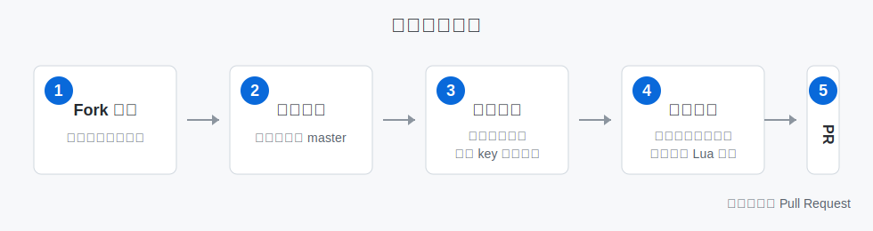

# RXSEND Breach Languages

本仓库用于维护 RXSEND Breach 的多语言文本。普通翻译贡献者只需要修改目标语言文件，不需要处理同步脚本或中文基准文件。



## 快速开始

1. 点击 GitHub 右上角的 **Fork**，把本仓库复制到自己的账号下。
2. 在你的 Fork 仓库里新建一个分支，例如 `translate-english-ui` 或 `translate-russian-roles`。
3. 打开要翻译的文件，例如 `languages/english.lua`、`languages/russian.lua`、`languages/tchinese.lua`。如果同名的 `*_extra.lua` 里也有缺失内容，也一起翻译。
4. 搜索以 `-- ` 开头的缺失占位行，把右侧中文文本翻译成目标语言，并删除行首的 `-- `。
5. 提交到你的分支，然后向本仓库的 `master` 分支发起 Pull Request。

## 应该改哪些文件

| 文件 | 用途 | 普通翻译者是否需要修改 |
| --- | --- | --- |
| `languages/chinese.lua` | 基准中文语言文件 | 否，除非你在维护新中文词条 |
| `languages/chinese_extra.lua` | 基准中文扩展语言文件 | 否，除非你在维护新中文词条 |
| `languages/b_chinese.lua` / `languages/b_chinese_extra.lua` | Bilibili 特供中文 | 通常不需要 |
| `languages/english.lua` / `languages/english_extra.lua` | 英文翻译 | 需要 |
| `languages/russian.lua` / `languages/russian_extra.lua` | 俄文翻译 | 需要 |
| `languages/tchinese.lua` / `languages/tchinese_extra.lua` | 繁体中文翻译 | 需要 |
| 其他非中文语言文件 | 对应语言翻译 | 需要 |

简单理解：翻译除 `chinese*` 和 `b_chinese*` 之外的语言文件即可。

## 缺失占位行怎么改

同步脚本会把目标语言缺失的 key 以注释形式补进去。翻译时只改右侧字符串，不要改左侧 key 路径。

修改前：

```lua
-- english.people_counts = "人员数量"
```

修改后：

```lua
english.people_counts = "People Count"
```

如果文本中有变量、格式符或换行符，必须原样保留：

```lua
english.NFailed = "Cannot access with this keycard: %s"
english.desc_intercom = "Please send facility broadcast...\nText only"
```

## 翻译规则

- 只修改引号里面的显示文本，不要改 `english.xxx`、`russian.xxx` 这类 key。
- 保留 `%s`、`%d`、`\n`、`sender`、`message`、`victim`、`killer` 等占位内容。
- 保持 Lua 语法有效：引号、逗号、花括号、方括号不要删错。
- 不确定的条目可以先保持注释状态，不要随便写错 key。
- 尽量保持同一语言内的角色名、阵营名、按钮名风格一致。
- 不要在一个 PR 里混入无关格式化、无关文件修改或大量机器翻译未校对内容。

## 提交 Pull Request

1. 提交信息建议写清楚语言和范围，例如：

```text
feat(lang): translate russian role descriptions
fix(lang): improve english scoreboard text
```

2. PR 说明里写清楚你改了哪些语言文件、翻译了哪些范围。
3. 如果维护者提出修改意见，继续在同一个分支追加提交，原 PR 会自动更新。

提交前可以按这个清单检查：

- 只改了目标语言文件。
- 已翻译的缺失行删除了行首 `-- `。
- 没有修改 key 路径。
- `%s`、`%d`、`\n` 和日志变量名都保留了。
- 文件末尾仍然保留 `ALLLANGUAGES.xxx = xxx`。

## 维护者同步流程

如果维护者在 `languages/chinese.lua` 或 `languages/chinese_extra.lua` 添加了新中文 key，推送到 `master` 后会触发 GitHub Actions：

- Workflow 名称：`Lang Parser Auto PR`
- 执行脚本：`python3 sync_missing_from_chinese.py --dir ./languages --base chinese.lua`
- 自动创建 PR：`Language: Update language files`
- 自动分支：`ci-update-language-files`

本地手动检查可以运行：

```powershell
python sync_missing_from_chinese.py --dir ./languages --base chinese.lua --dry-run
```

本地实际同步可以运行：

```powershell
python sync_missing_from_chinese.py --dir ./languages --base chinese.lua
```

只同步指定语言文件：

```powershell
python sync_missing_from_chinese.py --dir ./languages --base chinese.lua --targets english.lua russian.lua
```

## English Quick Guide

This repository stores translation files for RXSEND Breach. Translators usually only edit non-Chinese language files under `languages/`.

1. Fork this repository.
2. Create a branch in your fork.
3. Edit your target language file, such as `languages/english.lua` or `languages/russian.lua`.
4. Translate commented missing lines by changing only the text inside quotes and removing the leading `-- `.
5. Keep keys, placeholders like `%s` / `%d`, escaped newlines `\n`, and log variables unchanged.
6. Open a Pull Request back to this repository's `master` branch.
