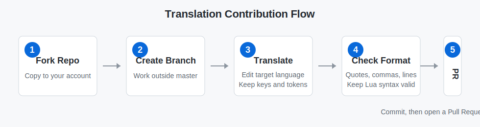

# RXSEND Breach Languages

This repository maintains the translation files for RXSEND Breach. Regular translation contributors only need to edit the target language files. You do not need to touch the sync script or the Chinese base files.

Chinese version: [README.md](README.md)



## Quick Start

1. Click **Fork** in the top-right corner of GitHub to copy this repository to your own account.
2. Create a new branch in your fork, such as `translate-english-ui` or `translate-russian-roles`.
3. Open the language file you want to translate, such as `languages/english.lua`, `languages/russian.lua`, or `languages/tchinese.lua`. If the matching `*_extra.lua` file also contains missing entries, translate those too.
4. Search for missing placeholder lines that start with `-- `. Translate the Chinese text on the right side into the target language, then remove the leading `-- `.
5. Commit your changes to your branch, then open a Pull Request back to this repository's `master` branch.

## Which Files To Edit

| File | Purpose | Should regular translators edit it? |
| --- | --- | --- |
| `languages/chinese.lua` | Chinese base language file | No, unless you maintain new Chinese entries |
| `languages/chinese_extra.lua` | Chinese base extra language file | No, unless you maintain new Chinese entries |
| `languages/b_chinese.lua` / `languages/b_chinese_extra.lua` | Bilibili special Chinese version | Usually no |
| `languages/english.lua` / `languages/english_extra.lua` | English translation | Yes |
| `languages/russian.lua` / `languages/russian_extra.lua` | Russian translation | Yes |
| `languages/tchinese.lua` / `languages/tchinese_extra.lua` | Traditional Chinese translation | Yes |
| Other non-Chinese language files | Their matching translations | Yes |

In short: translate language files other than `chinese*` and `b_chinese*`.

## How To Translate Missing Placeholder Lines

The sync script adds missing keys to target language files as commented placeholder lines. When translating, only edit the string on the right side. Do not change the key path on the left side.

Before:

```lua
-- english.people_counts = "人员数量"
```

After:

```lua
english.people_counts = "People Count"
```

If a text contains variables, format placeholders, or escaped newlines, keep them exactly as they are:

```lua
english.NFailed = "Cannot access with this keycard: %s"
english.desc_intercom = "Please send facility broadcast...\nText only"
```

## Translation Rules

- Only edit the visible text inside quotes. Do not change keys such as `english.xxx` or `russian.xxx`.
- Keep placeholders such as `%s`, `%d`, `\n`, `sender`, `message`, `victim`, and `killer`.
- Keep valid Lua syntax. Do not accidentally remove quotes, commas, braces, or brackets.
- If you are unsure about an entry, leave it commented instead of guessing the key or breaking the format.
- Keep role names, faction names, and button names consistent within the same language.
- Do not mix unrelated formatting, unrelated files, or large unreviewed machine translations into one PR.

## Submit A Pull Request

1. Use a commit message that describes the language and scope, for example:

```text
feat(lang): translate russian role descriptions
fix(lang): improve english scoreboard text
```

2. In the PR description, explain which language files and translation areas you changed.
3. If maintainers request changes, push more commits to the same branch. The PR will update automatically.

Before submitting, check:

- You only changed target language files.
- Translated missing lines no longer start with `-- `.
- You did not change key paths.
- `%s`, `%d`, `\n`, and log variable names are preserved.
- The file still keeps `ALLLANGUAGES.xxx = xxx` at the end.
